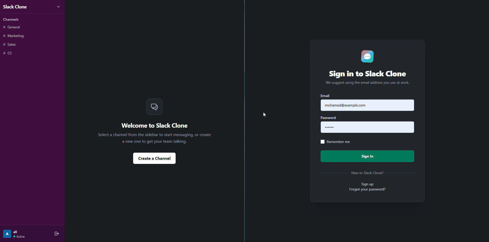

# 🚀 Slack Clone

> A high-fidelity, real-time messaging application inspired by Slack, built with Ruby on Rails and Hotwire.


<br/>
<div align="center">
  
</div>
<br/>

## 📋 Overview

This project is a fully-functional, real-time chat application modeled after Slack's core features. It demonstrates the power of modern Rails using Hotwire (Turbo & Stimulus) to deliver a seamless, Single-Page Application (SPA) feel without the complexity of a heavy JavaScript frontend framework.

### ✨ Key Features

- **Real-Time Messaging**: Messages appear instantly across all connected clients via ActionCable WebSockets.
- **Authentication**: Secure user registration and login powered by Devise.
- **Channel Management**: Users can create, edit, join, and delete channels. (Restricted to channel owners).
- **Membership Protection**: Secure backend access controls ensure only joined members can view or send messages in a channel.
- **Modern UI/UX**: A sleek, dark-themed interface built from scratch using Tailwind CSS, mimicking the professional look of modern chat apps.
- **Turbo 8 Morphing**: Leverages seamless page morphing (`broadcasts_refreshes`) to instantly update UI elements (like channel lists and member counts) across all clients without writing complex DOM manipulation logic.
- **Auto-Scrolling**: Intelligent chat interfaces that automatically scroll to the newest message, built with Stimulus controllers.

## 🛠️ Technology Stack

- **Backend**: Ruby on Rails 8.1
- **Database**: SQLite3 (Development/Test)
- **Frontend**: 
  - Tailwind CSS (Styling)
  - Hotwire Turbo (Fast page loads & real-time streams)
  - Stimulus.js (Lightweight DOM manipulation)
- **Authentication**: Devise
- **Testing**: RSpec, FactoryBot

## 🚀 Getting Started

### Prerequisites

- Ruby `~> 3.0`
- Rails `~> 8.0`
- Node.js & Yarn (for compiling Tailwind)

### Installation

1. **Clone the repository**
   ```bash
   git clone https://github.com/ebra8/the-slack-clone.git
   cd the-slack-clone
   ```

2. **Install dependencies**
   ```bash
   bundle install
   yarn install
   ```

3. **Database Setup**
   ```bash
   bin/rails db:prepare
   ```

4. **Start the Development Server**
   ```bash
   bin/dev
   ```
   > The application will be available at `http://localhost:3000`

## 🧪 Testing

This project uses RSpec for testing. To run the test suite:

```bash
bundle exec rspec
```

## 👨‍💻 Architecture Highlights

- **Turbo 8 Morphing & Streams**: By broadcasting morphing refreshes (`broadcasts_refreshes`) over WebSockets, the app achieves complex, real-time UI synchronization (e.g. updating channel counts and sidebars) seamlessly, avoiding brittle JavaScript patching.
- **Stimulus Controllers**: Used sparingly but effectively. For instance, `ChatScrollController` ensures the message view remains anchored to the newest messages.
- **Strict Authorization & Integrity**: Strong constraints built at the controller level (verifying `current_user` ownership/membership) and database level (foreign key cascades via `dependent: :destroy`) to ensure absolute data integrity.

## 📝 License

This project is open-source and available under the [MIT License](LICENSE).
